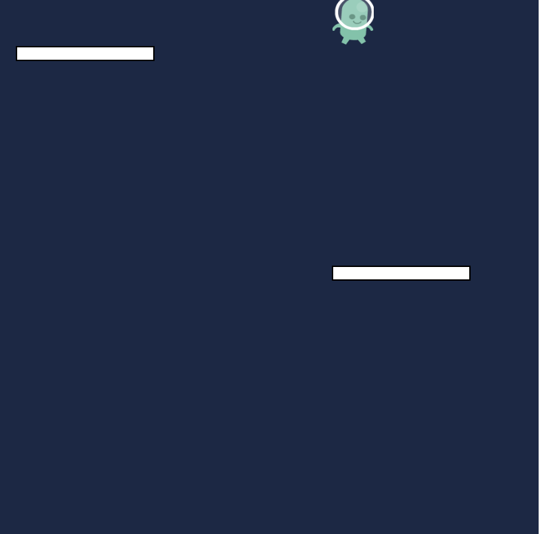
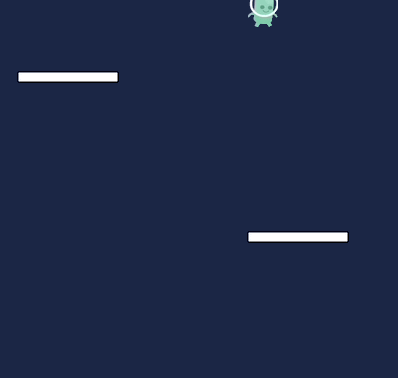
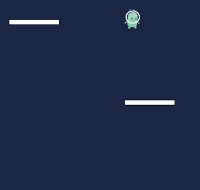
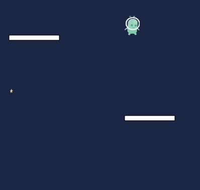
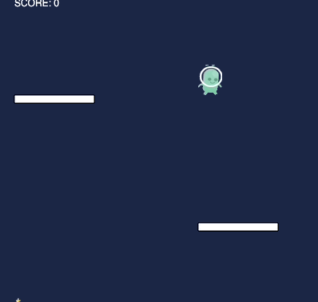

# Jumping Platforms

In preperation for your final game project for this course, we are going to build one game together in pairs. You are going to make a platform jumper game. The goal is to collect falling stars without going off the bottom of the screen. Your allien will need to be able to move left, right, and jump when you hit the spacebar. The game ends when your alien falls off the screen.

# Tasks
This is meant to be a guided walk through of how to go through the game design process. You can add your own features, but you should have the core functionality described in the introduction in order to earn full credit.

1. There is an image of an alien that will be our character today. Load the image in using `loadImage` insie the `function preload()`. Render the image using the `image` command inside `function draw()` and the coordinates stored in the character object like:

```javascript
image(alien, character.x, character.y, character.width, character.height)
```

2. There are two platforms. Using the `rect()` function and the coordinates stored in `platform1` and `platform2`, render each platform. 



3. Now that you have the platforms, we need to get them to move and loop. Have each platform move down the screen and reappear at the top if they reach the edge of the screen.



4. Have the alien fall down the screen. 

5. Declare an `alienControl()` function. The user should be able to move the alien left and right when they click the left/right arrow keys. The alien should jump when the space bar is pressed. 



6. Declare a new `star` object that gives the star an x, y, width, height, and speedY. Load the image of the star in and print the star to the scren, just like you did with the alien

7. Have the star fall down the screen and reappear at the top at a new random location if it reaches the bottom. You can add multiple, but we are goin to start with one.


8. All of the images can be thought of as rectangles, so we can use the `collideRectRect()` to detect if the alien has collided with either of the platforms or the star. Store the results in a variable

9. Write the following conditionals:
- If the alien collides with either of the platforms, set the aliens velocity to zero. Otherwise, set the velocity of the alien to 1.
- If the alien and the star collide, reset the star to the top of the screen. **BONUS**: Play a sound every time you collect a star.



10. Declare a `score` variable. Update the score everytime the alien collects a star. Print this score to the screen using the `text` command.

11. If the alien falls off the screen, print a GAME OVER message to the user. **HINT**: Use a conditional with the `background` command.



12. **BONUS**: Change the background and the speed at which the star and player fall as they reach new scores. For example, if they reach a score of 10, change the background to a light blue and have the alien and stars increase their speed to one more than it currently is. This will make the game harder as the 

13. **STRETCH**: The falling of the alien dosesn't seem very realistic. We need some gravity! To put gravity in the program, the alien needs to accelerate as it falls. Acceleration means increasing the velocity, which looks something like:

```javascript
function draw() {
	character.speedY += 1
}
```

Have the alien accelerate as it falls to create a more difficult game.

